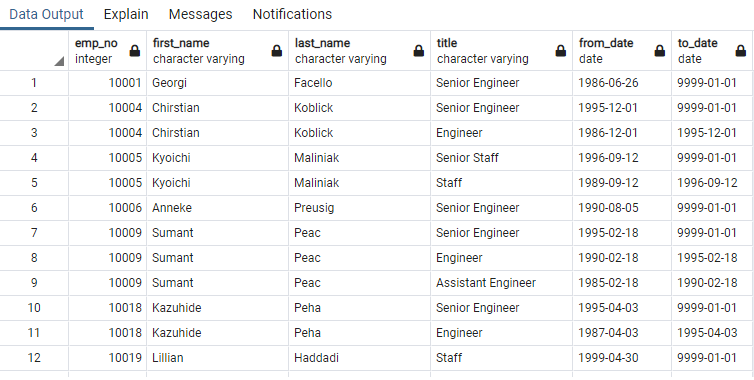
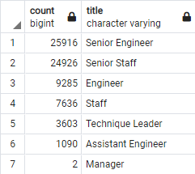
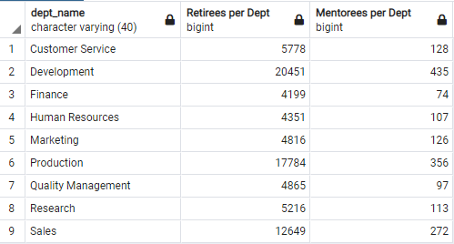
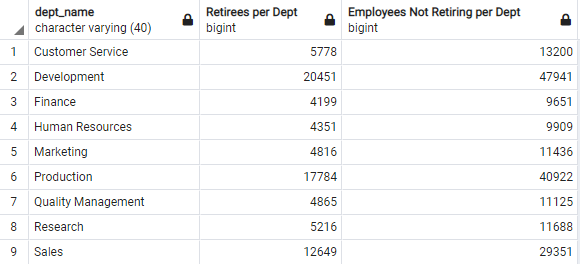

# Pewlett-Hackard-Analysis

## Resources

PostgresSQL 11.10, pgAdmin4, departments.csv, employees.csv, dept_emp.csv, dept_manager.csv, salaries.csv, titles.csv

## Overview

The Pewlett-Hackard company has several employees at or nearing retirement age.  They have supplied six csv files from which to construct and employees database.  The purpose of this analysis is to run queries and create additional tables in that database to help prepare for the retiring and replacing of so many employees.

The company specifically requested a table showing all current employees within the retirement-eligible age range along with all positions they've held while with the company; a table showing only the current positions held by retiriment-eligible employees so they can get an exact count; a table showing the number of retirees per job title so they can get an idea of the positions needed to be filled; and a table of current employees within a younger age bracket that could participate in a possible mentorship program with outgoing retirees to prepare to replace them.

## Results

- 72,458 employees have birthdays placing them in the age range that is eligible or nearing eligibility for retirement.

- Many retirement eligible employees have advanced through multiple positions within the company, as can be seen in this sample from the retirement titles table: 

- Over 50,000 retirement eligible employees currently hold senior staff or engineer positions, leadership roles, or management roles within the company, as can be seen in the retiring titles table here:

- 1,549 employees fall in the age range making them eligible to be mentored by outgoing retirees as part of the proposed mentorship program.

## Summary

In summary, 72,458 employees will be retiring soon and leaving vacancies that will need to be filled.  Many of them have advanced through multiple positions into senior or leadership roles.  Because so many of the vacancies left will be in such key roles, the proposed mentorship program will be a positive step in making sure these vacancies can be filled by quality candidates.  With only 1,549 employees in the age group proposed to be mentored by outgoing retirees, there are more than enough retirees to act as mentors.  Furthermore, there are more than enough retirees to mentor the proposed mentorees within each department, as can be seen here:

Because so many employees are retiring, and so few employees fall in the proposed mentorship group, the proposed age range for mentorees could be expanded to allow for more employees to be mentored to fill roles.  As can be seen in this table, the total number of employees not retiring in each department is far greater than those retiring, so that pool of employees should provide more than enough qualified candidates in each department to be mentored and fill vacant roles.

